# Screens & UI Design

## 📸 Demo Screenshots (Thực tế)

Các màn hình được capture từ demo chạy thực tế với dữ liệu mẫu:

| Màn hình | Screenshot |
|----------|-----------|
| Login | 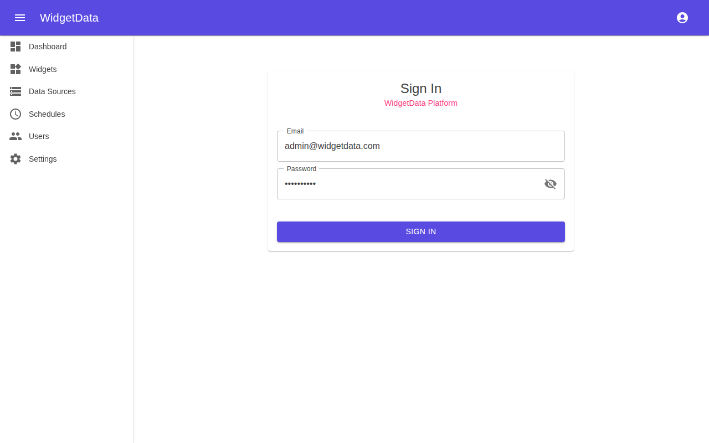 |
| Dashboard | 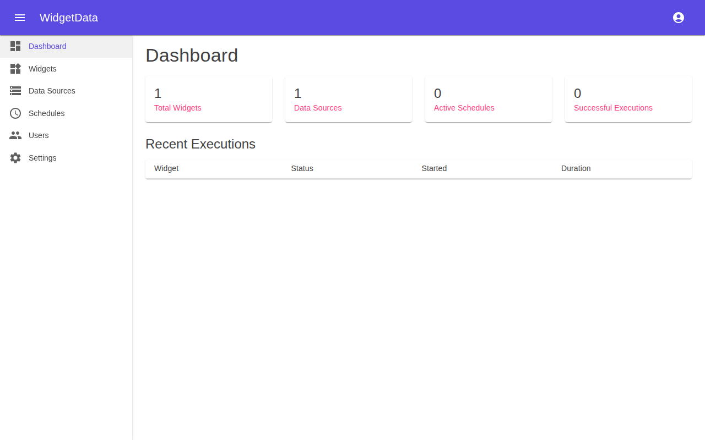 |
| Widgets | 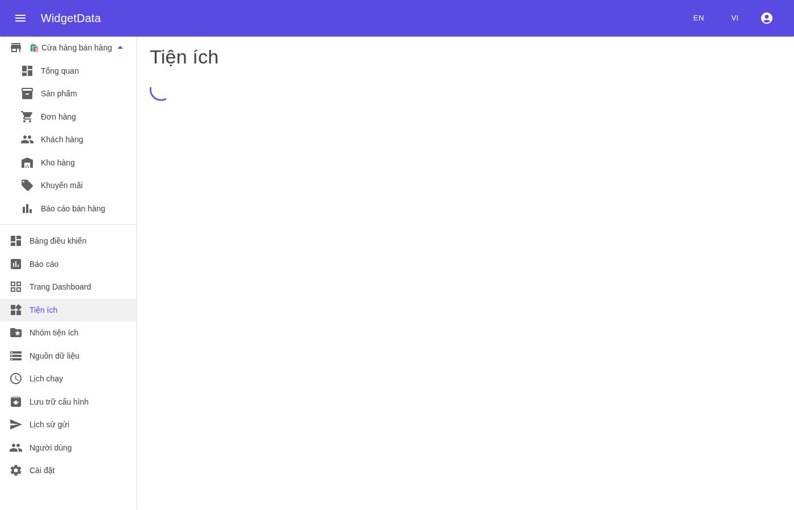 |
| Nhóm Widget | 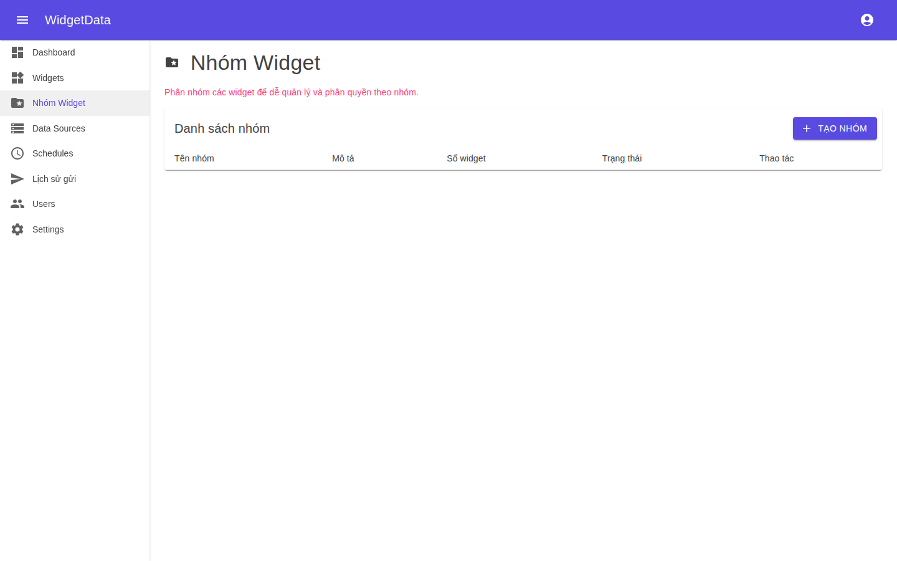 |
| Data Sources | 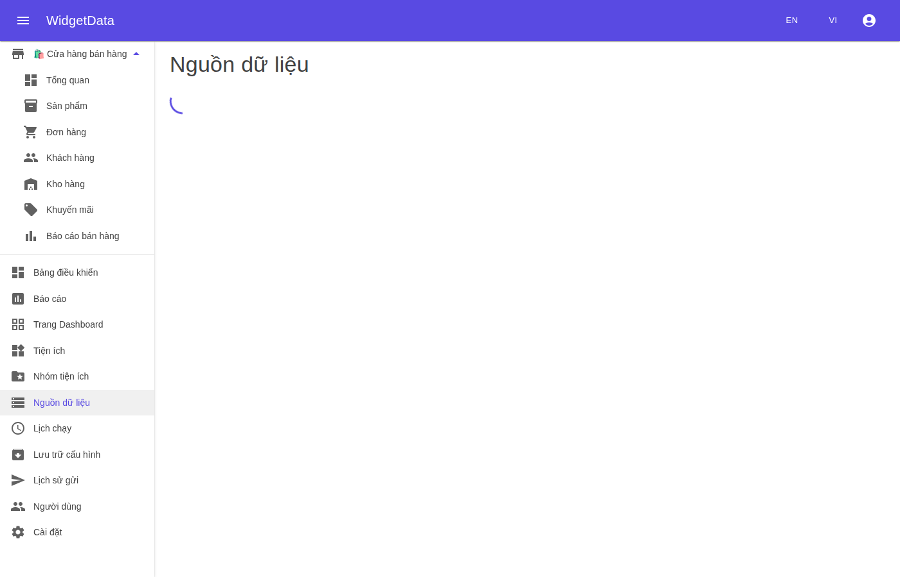 |
| Schedules | 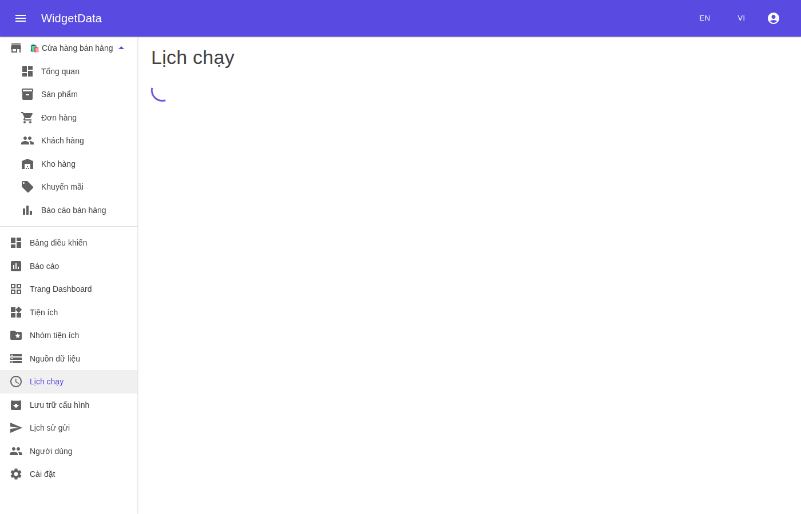 |
| Lịch sử gửi | 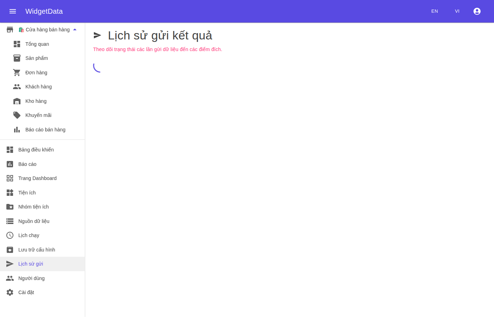 |
| Users | 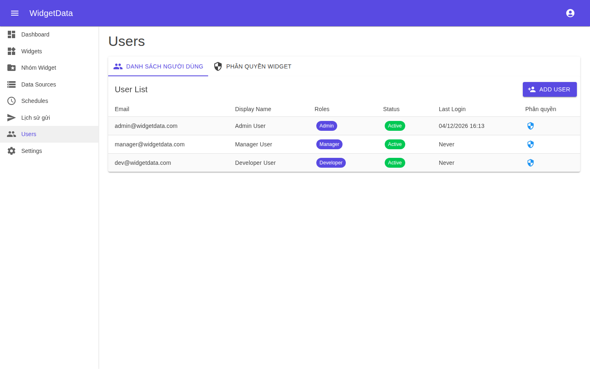 |
| Settings | 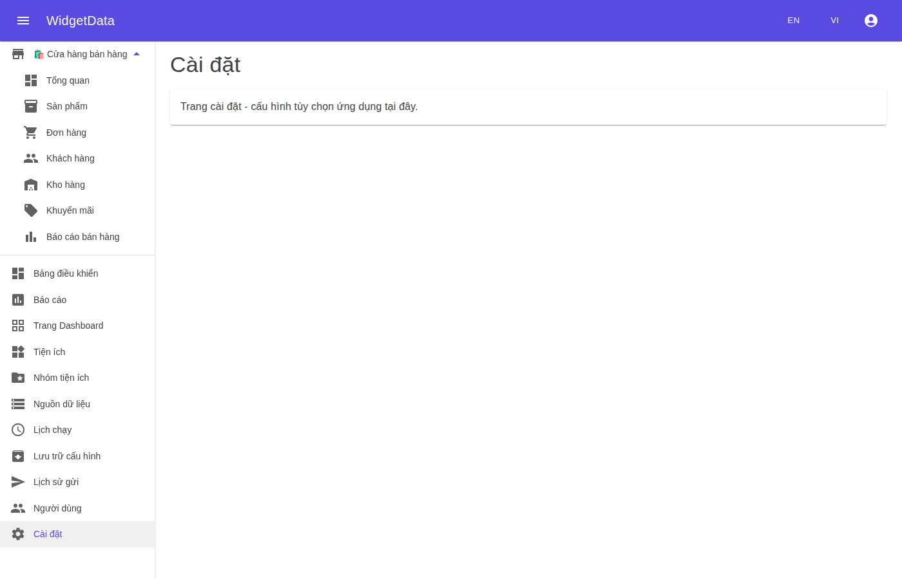 |
| Widget Configure | 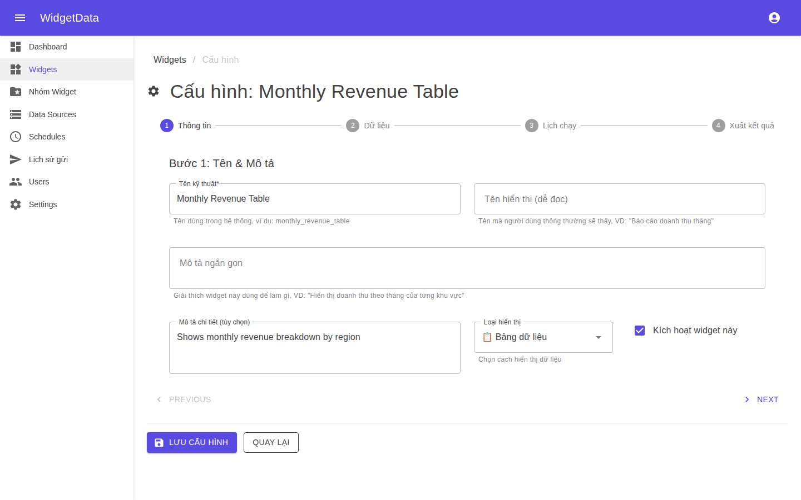 |

---

## 📸 Chi tiết từng bước / từng tab

### 👥 Users – Các tab

| Tab | Mô tả | Screenshot |
|-----|-------|-----------|
| Tab 1: Danh sách người dùng | Bảng user với role, status, last login |  |
| Tab 2: Phân quyền Widget (chưa chọn user) | Hướng dẫn chọn user | 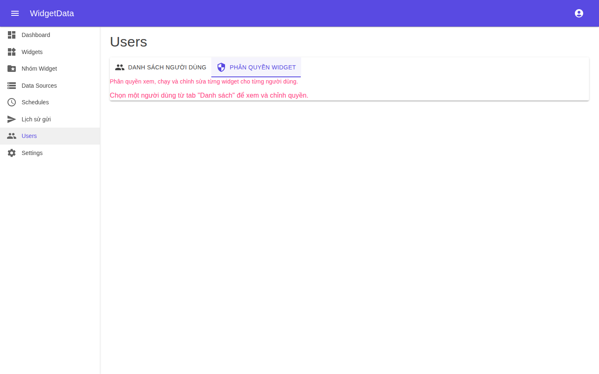 |
| Tab 2: Phân quyền Widget (đã chọn user) | Hiện quyền của user, nút thêm quyền | 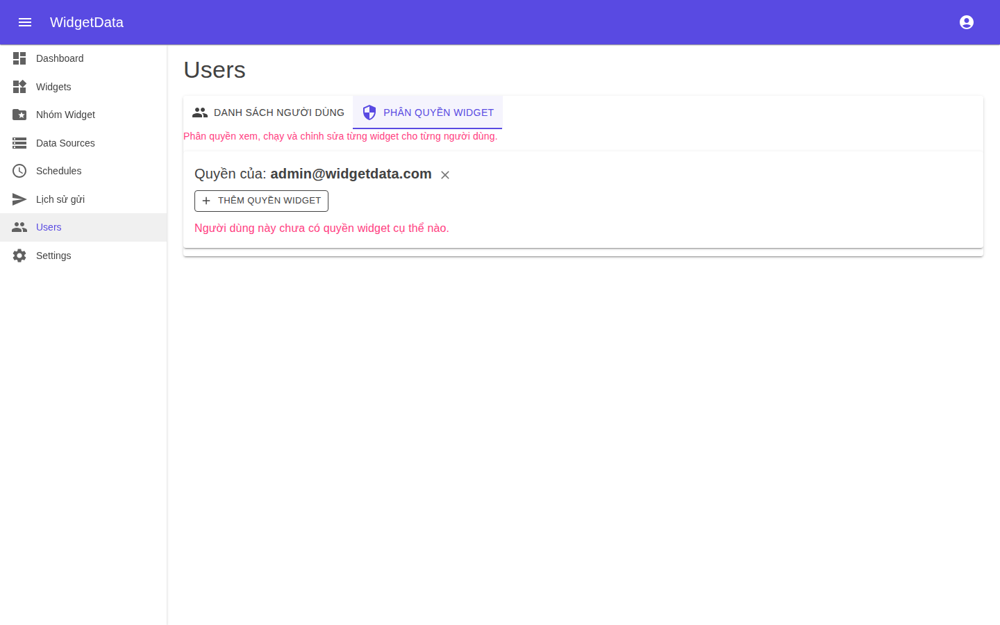 |

### ⚙️ Widget Configure – Các bước

| Bước | Mô tả | Screenshot |
|------|-------|-----------|
| Bước 1: Thông tin | Tên kỹ thuật, tên hiển thị, loại widget, kích hoạt |  |
| Bước 2: Dữ liệu | Chọn data source, câu truy vấn, cấu hình cache | 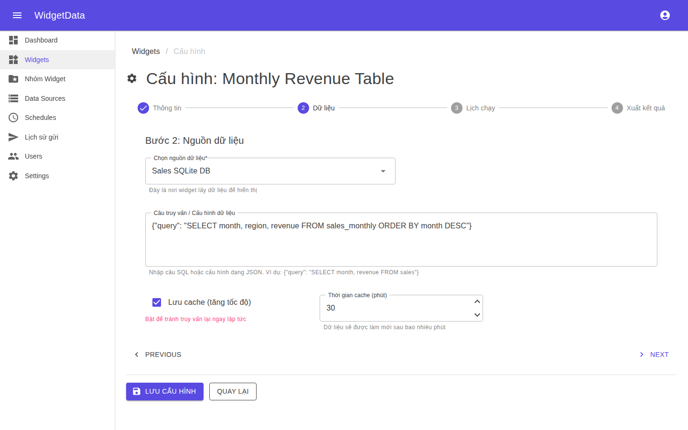 |
| Bước 3: Lịch chạy | Xem lịch cron hiện tại, link tới Schedules | 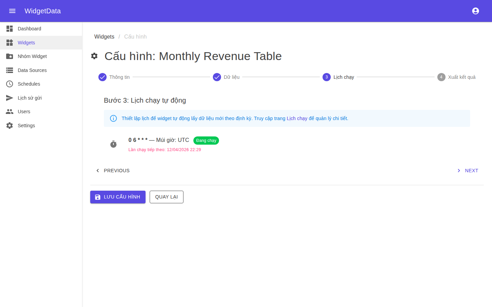 |
| Bước 4: Xuất kết quả | Tải xuống CSV/Excel/PDF/HTML/TXT, thêm điểm gửi | 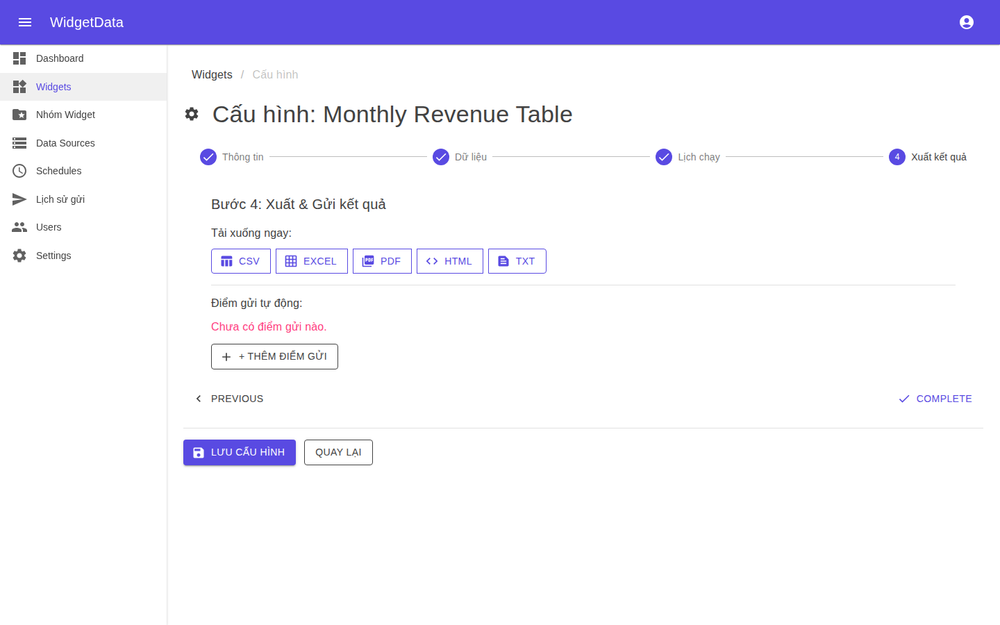 |

---

## 📋 Tổng quan

Widget Data có **15 màn hình chính** được tổ chức thành 5 nhóm:

1. **Dashboard & Overview** (2 screens)
2. **Widget Management** (4 screens)
3. **Data Sources** (3 screens)
4. **Scheduling & Execution** (2 screens)
5. **Administration** (4 screens)

---

## 🏠 1. Dashboard & Overview

### 1.1. Main Dashboard (`/dashboard`)

**Mục đích:** Trang chủ hiển thị tổng quan widgets, metrics, và recent activities

**Layout:**
```
┌─────────────────────────────────────────────────────────┐
│ [≡] Widget Data                    [🔔] [👤] admin      │
├─────────────────────────────────────────────────────────┤
│                                                         │
│  📊 Dashboard                                           │
│  ─────────────────────────────────────────────────────  │
│                                                         │
│  ┌─────────────┐ ┌─────────────┐ ┌─────────────┐      │
│  │ 📈 Total    │ │ ✅ Active   │ │ ⏱️ Running  │      │
│  │ Widgets     │ │ Widgets     │ │ Jobs        │      │
│  │    45       │ │    38       │ │    12       │      │
│  └─────────────┘ └─────────────┘ └─────────────┘      │
│                                                         │
│  ┌─────────────────────────────────────────────────┐   │
│  │ 📊 Execution History (Last 7 Days)             │   │
│  │ [Line Chart showing executions over time]      │   │
│  │                                                 │   │
│  └─────────────────────────────────────────────────┘   │
│                                                         │
│  ┌───────────────────────┐ ┌───────────────────────┐   │
│  │ 🆕 Recent Widgets     │ │ ⚠️ Failed Executions  │   │
│  │ • Sales Report        │ │ • API Widget (#342)   │   │
│  │ • Customer Data       │ │   Error: Timeout      │   │
│  │ • Inventory Widget    │ │ • DB Widget (#287)    │   │
│  └───────────────────────┘ └───────────────────────┘   │
│                                                         │
│  ┌─────────────────────────────────────────────────┐   │
│  │ 📅 Upcoming Schedules                           │   │
│  │ ┌──────────────────────────────────────────┐    │   │
│  │ │ Widget Name    │ Next Run    │ Frequency│    │   │
│  │ ├──────────────────────────────────────────┤    │   │
│  │ │ Sales Report   │ 10:00 AM    │ Daily    │    │   │
│  │ │ Customer KPIs  │ 2:00 PM     │ Hourly   │    │   │
│  │ └──────────────────────────────────────────┘    │   │
│  └─────────────────────────────────────────────────┘   │
│                                                         │
└─────────────────────────────────────────────────────────┘
```

**Components:**
- **Header**: AppBar với navigation, notifications, user menu
- **Stats Cards**: 3 summary cards (Total, Active, Running)
- **Chart**: Line/bar chart cho execution trends
- **Recent Widgets**: List của widgets mới tạo
- **Failed Executions**: Alert list với errors
- **Upcoming Schedules**: DataGrid với scheduled jobs

**Actions:**
- `[+ Create Widget]` - Navigate to Widget Builder
- `[View All Widgets]` - Navigate to Widget List
- Click widget name → Navigate to Widget Detail

**Data Displayed:**
```csharp
public class DashboardViewModel
{
    public int TotalWidgets { get; set; }
    public int ActiveWidgets { get; set; }
    public int RunningJobs { get; set; }
    public List<ExecutionHistoryDto> ExecutionHistory { get; set; }
    public List<WidgetSummaryDto> RecentWidgets { get; set; }
    public List<FailedExecutionDto> FailedExecutions { get; set; }
    public List<ScheduleDto> UpcomingSchedules { get; set; }
}
```

---

### 1.2. Analytics Dashboard (`/analytics`)

**Mục đích:** Chi tiết analytics & reports

**Layout:**
```
┌─────────────────────────────────────────────────────────┐
│ 📊 Analytics & Reports                                  │
├─────────────────────────────────────────────────────────┤
│                                                         │
│  Date Range: [Jan 1, 2026 ▼] - [Apr 10, 2026 ▼] [Apply]│
│                                                         │
│  ┌─────────────────────────────────────────────────┐   │
│  │ Widget Performance                               │   │
│  │ ┌────────────────────────────────────────────┐   │   │
│  │ │ Widget Name    Executions  Avg Time  Success│   │   │
│  │ ├────────────────────────────────────────────┤   │   │
│  │ │ Sales Report      1,245      2.3s    98.5% │   │   │
│  │ │ Customer Data       892      1.8s    99.2% │   │   │
│  │ │ Inventory           456      4.1s    95.0% │   │   │
│  │ └────────────────────────────────────────────┘   │   │
│  └─────────────────────────────────────────────────┘   │
│                                                         │
│  ┌───────────────────────┐ ┌───────────────────────┐   │
│  │ Top Data Sources      │ │ Peak Usage Hours      │   │
│  │ [Pie Chart]           │ │ [Heat Map]            │   │
│  └───────────────────────┘ └───────────────────────┘   │
│                                                         │
│  ┌─────────────────────────────────────────────────┐   │
│  │ Export Options                                   │   │
│  │ [📄 PDF] [📊 Excel] [📧 Email Report]           │   │
│  └─────────────────────────────────────────────────┘   │
│                                                         │
└─────────────────────────────────────────────────────────┘
```

**Features:**
- Date range picker
- Performance metrics table
- Interactive charts (Pie, Heat map, Line)
- Export to PDF/Excel
- Email scheduled reports

---

## 🎨 2. Widget Management

### 2.1. Widget List (`/widgets`)

**Mục đích:** Danh sách tất cả widgets với filter, search, sort

**Layout:**
```
┌─────────────────────────────────────────────────────────┐
│ 🎨 Widgets                                              │
├─────────────────────────────────────────────────────────┤
│                                                         │
│  [🔍 Search...]  [Type: All ▼] [Status: All ▼] [+ New] │
│                                                         │
│  ┌─────────────────────────────────────────────────┐   │
│  │ Name          Type    Source    Status  Actions │   │
│  ├─────────────────────────────────────────────────┤   │
│  │ Sales Report  Chart   SQL DB    ✅ Active       │   │
│  │                               [▶️] [✏️] [🗑️] [⋯] │   │
│  ├─────────────────────────────────────────────────┤   │
│  │ Customer KPIs Table   CSV       ✅ Active       │   │
│  │                               [▶️] [✏️] [🗑️] [⋯] │   │
│  ├─────────────────────────────────────────────────┤   │
│  │ Inventory     Metric  API       ⏸️ Inactive     │   │
│  │                               [▶️] [✏️] [🗑️] [⋯] │   │
│  ├─────────────────────────────────────────────────┤   │
│  │ Regional Sales Map   Excel      ✅ Active       │   │
│  │                               [▶️] [✏️] [🗑️] [⋯] │   │
│  └─────────────────────────────────────────────────┘   │
│                                                         │
│  Showing 1-10 of 45      [◀️ Prev] [1] [2] [3] [Next ▶️] │
│                                                         │
└─────────────────────────────────────────────────────────┘
```

**Features:**
- **Search**: Tìm theo tên widget
- **Filters**: Type (chart, table, metric, map), Status (active/inactive)
- **Bulk Actions**: Select multiple → Delete, Export, Activate/Deactivate
- **Quick Actions**:
  - `▶️` Execute widget immediately
  - `✏️` Edit widget
  - `🗑️` Delete widget
  - `⋯` More options (Clone, Share, Schedule)

**Responsive:**
- Desktop: Table view
- Tablet: Card view with 2 columns
- Mobile: List view with swipe actions

---

### 2.2. Widget Builder (`/widgets/new`, `/widgets/{id}/edit`)

**Mục đích:** Visual builder để tạo/sửa widget với multi-step pipeline

**Layout:**
```
┌─────────────────────────────────────────────────────────┐
│ 🎨 Widget Builder                        [Save] [Cancel]│
├─────────────────────────────────────────────────────────┤
│                                                         │
│  ┌─────────────┐  Widget Name: [Sales Report______]    │
│  │ 1️⃣ Basic   │  Widget Type: [Chart ▼]                │
│  │ 2️⃣ Steps   │  Description: [Monthly sales analysis_]│
│  │ 3️⃣ Visual  │                                         │
│  │ 4️⃣ Schedule│  ┌───────────────────────────────────┐ │
│  └─────────────┘  │ Tags: [sales] [monthly] [+ Add] │ │
│                   └───────────────────────────────────┘ │
│                                                         │
│  ════════════════════════════════════════════════════   │
│                                                         │
│  Pipeline Steps:                                        │
│                                                         │
│  ┌─────────────────────────────────────────────────┐   │
│  │ Step 1: Extract                              [X]│   │
│  │ ┌─────────────────────────────────────────────┐ │   │
│  │ │ Data Source: [SQL Server - Sales DB ▼]     │ │   │
│  │ │ Query:                                      │ │   │
│  │ │ ┌─────────────────────────────────────────┐ │ │   │
│  │ │ │ SELECT * FROM Orders                    │ │ │   │
│  │ │ │ WHERE OrderDate >= @StartDate           │ │ │   │
│  │ │ └─────────────────────────────────────────┘ │ │   │
│  │ │ Output Variable: [orders]                   │ │   │
│  │ └─────────────────────────────────────────────┘ │   │
│  └─────────────────────────────────────────────────┘   │
│                            ⬇️                            │
│  ┌─────────────────────────────────────────────────┐   │
│  │ Step 2: Transform                            [X]│   │
│  │ ┌─────────────────────────────────────────────┐ │   │
│  │ │ Input: [orders ▼]                           │ │   │
│  │ │ Transformation: [Add calculated column ▼]  │ │   │
│  │ │   New Column: [profit]                      │ │   │
│  │ │   Formula: [revenue - cost]                 │ │   │
│  │ │ Output Variable: [enriched_orders]          │ │   │
│  │ └─────────────────────────────────────────────┘ │   │
│  └─────────────────────────────────────────────────┘   │
│                            ⬇️                            │
│  ┌─────────────────────────────────────────────────┐   │
│  │ Step 3: Aggregate                            [X]│   │
│  │ ┌─────────────────────────────────────────────┐ │   │
│  │ │ Input: [enriched_orders ▼]                  │ │   │
│  │ │ Group By: [product_category]                │ │   │
│  │ │ Aggregations:                               │ │   │
│  │ │   • SUM(revenue) AS total_revenue           │ │   │
│  │ │   • AVG(profit) AS avg_profit               │ │   │
│  │ │ Output Variable: [summary]                  │ │   │
│  │ └─────────────────────────────────────────────┘ │   │
│  └─────────────────────────────────────────────────┘   │
│                                                         │
│  [+ Add Step ▼] [Extract] [Transform] [Filter] [More]  │
│                                                         │
│  ┌─────────────────────────────────────────────────┐   │
│  │ Preview Data (Last 10 rows)                     │   │
│  │ ┌───────────────────────────────────────────┐   │   │
│  │ │ Category      Total Revenue  Avg Profit   │   │   │
│  │ ├───────────────────────────────────────────┤   │   │
│  │ │ Electronics      $125,000      $25,000   │   │   │
│  │ │ Clothing         $85,000       $18,500   │   │   │
│  │ └───────────────────────────────────────────┘   │   │
│  └─────────────────────────────────────────────────┘   │
│                                                         │
│  [⬅️ Previous] [Test Run] [Next: Visualization ➡️]     │
│                                                         │
└─────────────────────────────────────────────────────────┘
```

**Features:**
- **4-Step Wizard**:
  1. Basic Info (name, type, description)
  2. Pipeline Steps (drag-and-drop builder)
  3. Visualization Config (chart type, colors, axes)
  4. Schedule Setup (cron, timezone)

- **Step Builder**:
  - Drag-and-drop steps from toolbox
  - Reorder steps
  - Configure each step with form
  - Visual flow diagram
  - Real-time preview

- **Step Types**:
  - Extract (SQL, CSV, API, Excel)
  - Transform (Add column, Rename, Format)
  - Filter (Conditions)
  - Join (Merge datasets)
  - Aggregate (Group by, Sum, Avg)
  - Branch (If-else, Switch)
  - Custom (Plugin steps)

---

### 2.3. Widget Detail View (`/widgets/{id}`)

**Mục đích:** Xem chi tiết widget, execute, view results, history

**Layout:**
```
┌─────────────────────────────────────────────────────────┐
│ 📊 Sales Report                    [✏️ Edit] [🗑️ Delete]│
├─────────────────────────────────────────────────────────┤
│                                                         │
│  ┌─────────────┐  ┌─────────────┐  ┌─────────────┐    │
│  │ Status      │  │ Last Run    │  │ Total Runs  │    │
│  │ ✅ Active   │  │ 10 min ago  │  │   1,245     │    │
│  └─────────────┘  └─────────────┘  └─────────────┘    │
│                                                         │
│  [▶️ Execute Now] [⏰ Schedule] [📊 View History]       │
│                                                         │
│  ┌─────────────────────────────────────────────────┐   │
│  │ 📈 Live Results                                  │   │
│  │ ┌─────────────────────────────────────────────┐ │   │
│  │ │                                             │ │   │
│  │ │     [Bar Chart: Sales by Category]          │ │   │
│  │ │                                             │ │   │
│  │ │     Electronics ████████████ $125,000      │ │   │
│  │ │     Clothing    ████████ $85,000           │ │   │
│  │ │     Home        ██████ $62,000             │ │   │
│  │ │                                             │ │   │
│  │ └─────────────────────────────────────────────┘ │   │
│  │                                                  │   │
│  │ Last Updated: Apr 10, 2026 10:30 AM             │   │
│  │ Rows: 3 | Execution Time: 2.3s                  │   │
│  │                                                  │   │
│  │ [🔄 Refresh] [📥 Export CSV] [📧 Email]         │   │
│  └─────────────────────────────────────────────────┘   │
│                                                         │
│  ┌─────────────────────────────────────────────────┐   │
│  │ Configuration                                    │   │
│  │ • Type: Chart (Bar)                             │   │
│  │ • Data Source: SQL Server - Sales DB            │   │
│  │ • Schedule: Daily at 2:00 AM                    │   │
│  │ • Tags: sales, monthly                          │   │
│  │ • Created: Mar 15, 2026 by admin                │   │
│  └─────────────────────────────────────────────────┘   │
│                                                         │
│  ┌─────────────────────────────────────────────────┐   │
│  │ Pipeline Steps (3)                               │   │
│  │ 1. Extract from SQL                              │   │
│  │ 2. Transform: Add profit column                  │   │
│  │ 3. Aggregate by category                         │   │
│  │                                   [View Details] │   │
│  └─────────────────────────────────────────────────┘   │
│                                                         │
└─────────────────────────────────────────────────────────┘
```

**Features:**
- Real-time widget visualization
- Execute on-demand
- Export results (CSV, Excel, PDF)
- Email results
- View execution history
- Edit/Delete widget
- Clone widget
- Share widget (generate public link)

---

### 2.4. Execution History (`/widgets/{id}/history`)

**Mục đích:** Xem lịch sử thực thi widget

**Layout:**
```
┌─────────────────────────────────────────────────────────┐
│ 📜 Execution History - Sales Report                     │
├─────────────────────────────────────────────────────────┤
│                                                         │
│  Filter: [Last 7 Days ▼] [Status: All ▼] [Search...]   │
│                                                         │
│  ┌─────────────────────────────────────────────────┐   │
│  │ Timestamp        Status  Duration  Rows  Actions│   │
│  ├─────────────────────────────────────────────────┤   │
│  │ Apr 10 10:30 AM  ✅ Success  2.3s   1,245  [👁️]  │   │
│  ├─────────────────────────────────────────────────┤   │
│  │ Apr 10 02:00 AM  ✅ Success  2.1s   1,243  [👁️]  │   │
│  ├─────────────────────────────────────────────────┤   │
│  │ Apr 09 02:00 AM  ❌ Failed   15s     0     [👁️]  │   │
│  │                  Error: Database timeout         │   │
│  ├─────────────────────────────────────────────────┤   │
│  │ Apr 08 02:00 AM  ✅ Success  2.2s   1,238  [👁️]  │   │
│  └─────────────────────────────────────────────────┘   │
│                                                         │
│  Showing 1-10 of 156    [◀️ Prev] [1] [2] [3] [Next ▶️] │
│                                                         │
│  ┌─────────────────────────────────────────────────┐   │
│  │ Execution Trends                                 │   │
│  │ [Line Chart: Success Rate & Avg Duration]       │   │
│  └─────────────────────────────────────────────────┘   │
│                                                         │
└─────────────────────────────────────────────────────────┘
```

**Actions:**
- Click `[👁️]` → View execution details & results
- Filter by date range, status
- Download execution log
- Re-run failed execution

---

## 🗄️ 3. Data Sources

### 3.1. Data Sources List (`/data-sources`)

**Layout:**
```
┌─────────────────────────────────────────────────────────┐
│ 🗄️ Data Sources                                         │
├─────────────────────────────────────────────────────────┤
│                                                         │
│  [🔍 Search...]  [Type: All ▼]  [+ Add Data Source]     │
│                                                         │
│  ┌─────────────────────────────────────────────────┐   │
│  │ 💾 SQL Server - Sales DB                        │   │
│  │ Server: sql-server.local | Database: SalesDB    │   │
│  │ Status: ✅ Connected | Last Test: 5 min ago     │   │
│  │ Used by: 15 widgets                             │   │
│  │ [Test Connection] [Edit] [Delete]               │   │
│  └─────────────────────────────────────────────────┘   │
│                                                         │
│  ┌─────────────────────────────────────────────────┐   │
│  │ 📊 CSV - Customer Data                          │   │
│  │ File: /uploads/customers.csv                    │   │
│  │ Status: ✅ Active | Size: 2.5 MB                │   │
│  │ Used by: 5 widgets                              │   │
│  │ [Upload New] [Edit] [Delete]                    │   │
│  └─────────────────────────────────────────────────┘   │
│                                                         │
│  ┌─────────────────────────────────────────────────┐   │
│  │ 🌐 REST API - Weather Service                   │   │
│  │ Endpoint: https://api.weather.com/v1/data       │   │
│  │ Status: ✅ Connected | Last Test: 2 hours ago   │   │
│  │ Used by: 3 widgets                              │   │
│  │ [Test] [Edit] [Delete]                          │   │
│  └─────────────────────────────────────────────────┘   │
│                                                         │
└─────────────────────────────────────────────────────────┘
```

**Data Source Types:**
- SQL Database (SQL Server, PostgreSQL, MySQL)
- CSV File
- Excel File (.xlsx)
- JSON File
- XML File
- REST API
- SOAP Web Service

---

### 3.2. Add/Edit Data Source (`/data-sources/new`, `/data-sources/{id}/edit`)

**Layout (SQL Server Example):**
```
┌─────────────────────────────────────────────────────────┐
│ 🗄️ Add Data Source                  [Save] [Cancel]     │
├─────────────────────────────────────────────────────────┤
│                                                         │
│  Source Type: [SQL Server ▼]                            │
│                                                         │
│  ┌─────────────────────────────────────────────────┐   │
│  │ Connection Details                               │   │
│  │                                                  │   │
│  │ Name: [Sales Database__________________]         │   │
│  │                                                  │   │
│  │ Server: [sql-server.local______________]         │   │
│  │ Port:   [1433____]                               │   │
│  │                                                  │   │
│  │ Database: [SalesDB_____________________]         │   │
│  │                                                  │   │
│  │ Authentication:                                  │   │
│  │ ◉ Windows Authentication                        │   │
│  │ ○ SQL Server Authentication                     │   │
│  │   Username: [_____________________________]     │   │
│  │   Password: [_____________________________]     │   │
│  │                                                  │   │
│  │ [🔗 Test Connection]                            │   │
│  │                                                  │   │
│  │ ☐ Use connection pooling                        │   │
│  │ ☐ Encrypt connection                            │   │
│  │                                                  │   │
│  └─────────────────────────────────────────────────┘   │
│                                                         │
│  ┌─────────────────────────────────────────────────┐   │
│  │ Advanced Settings                                │   │
│  │ Connection Timeout: [30_] seconds                │   │
│  │ Command Timeout:    [60_] seconds                │   │
│  │ Max Pool Size:      [100] connections            │   │
│  └─────────────────────────────────────────────────┘   │
│                                                         │
│  [💾 Save Data Source]                                  │
│                                                         │
└─────────────────────────────────────────────────────────┘
```

**Form Variations:**
- **CSV/Excel**: File upload, column mapping
- **API**: URL, authentication (API key, OAuth), headers
- **JSON/XML**: File upload or URL

---

### 3.3. Data Source Preview (`/data-sources/{id}/preview`)

**Layout:**
```
┌─────────────────────────────────────────────────────────┐
│ 🔍 Data Source Preview - Sales Database                 │
├─────────────────────────────────────────────────────────┤
│                                                         │
│  Tables: [Orders ▼]                                     │
│                                                         │
│  Query:                                                 │
│  ┌─────────────────────────────────────────────────┐   │
│  │ SELECT TOP 100 * FROM Orders                    │   │
│  │ WHERE OrderDate >= '2026-01-01'                 │   │
│  └─────────────────────────────────────────────────┘   │
│  [▶️ Run Query]                                         │
│                                                         │
│  Results (100 rows):                                    │
│  ┌─────────────────────────────────────────────────┐   │
│  │ OrderID  CustomerID  OrderDate    Total  Status │   │
│  ├─────────────────────────────────────────────────┤   │
│  │ 1001     C-123       2026-01-15   $250   Paid   │   │
│  │ 1002     C-456       2026-01-16   $180   Paid   │   │
│  │ 1003     C-789       2026-01-17   $420   Pending│   │
│  │ ...                                             │   │
│  └─────────────────────────────────────────────────┘   │
│                                                         │
│  [📥 Export Results] [📋 Copy Query]                    │
│                                                         │
└─────────────────────────────────────────────────────────┘
```

**Features:**
- SQL editor with syntax highlighting
- Table/schema browser
- Query results preview
- Export query results
- Save queries as templates

---

## ⏰ 4. Scheduling & Execution

### 4.1. Schedules List (`/schedules`)

**Layout:**
```
┌─────────────────────────────────────────────────────────┐
│ ⏰ Schedules                                             │
├─────────────────────────────────────────────────────────┤
│                                                         │
│  [Active ▼] [🔍 Search...]                              │
│                                                         │
│  ┌─────────────────────────────────────────────────┐   │
│  │ Widget Name   │ Schedule      │ Next Run │ Status│  │
│  ├─────────────────────────────────────────────────┤   │
│  │ Sales Report  │ Daily 2:00 AM │ Tomorrow │ ✅    │  │
│  │               │               │ 2:00 AM  │       │  │
│  │               │ [Edit] [Pause] [Run Now]        │  │
│  ├─────────────────────────────────────────────────┤   │
│  │ Customer KPIs │ Every 1 hour  │ In 23 min│ ✅    │  │
│  │               │               │          │       │  │
│  │               │ [Edit] [Pause] [Run Now]        │  │
│  ├─────────────────────────────────────────────────┤   │
│  │ Inventory     │ Mon-Fri 8 AM  │ Tomorrow │ ⏸️    │  │
│  │               │               │ 8:00 AM  │ Paused│  │
│  │               │ [Edit] [Resume] [Run Now]       │  │
│  └─────────────────────────────────────────────────┘   │
│                                                         │
│  ┌─────────────────────────────────────────────────┐   │
│  │ 📅 Calendar View                                 │   │
│  │ [Mini calendar with scheduled jobs marked]      │   │
│  └─────────────────────────────────────────────────┘   │
│                                                         │
└─────────────────────────────────────────────────────────┘
```

**Actions:**
- Pause/Resume schedule
- Edit schedule (cron expression)
- Run now (execute immediately)
- Delete schedule
- View execution history

---

### 4.2. Schedule Editor (`/schedules/{id}/edit`)

**Layout:**
```
┌─────────────────────────────────────────────────────────┐
│ ⏰ Edit Schedule - Sales Report      [Save] [Cancel]    │
├─────────────────────────────────────────────────────────┤
│                                                         │
│  Widget: Sales Report (Read-only)                       │
│                                                         │
│  ┌─────────────────────────────────────────────────┐   │
│  │ Schedule Type                                    │   │
│  │ ◉ Recurring                                      │   │
│  │ ○ One-time                                       │   │
│  │ ○ Event-driven (webhook)                        │   │
│  └─────────────────────────────────────────────────┘   │
│                                                         │
│  ┌─────────────────────────────────────────────────┐   │
│  │ Recurrence Pattern                               │   │
│  │                                                  │   │
│  │ Frequency: [Daily ▼]                             │   │
│  │                                                  │   │
│  │ Time: [02:00 AM ▼]                               │   │
│  │                                                  │   │
│  │ Timezone: [UTC ▼]                                │   │
│  │                                                  │   │
│  │ Cron Expression: 0 2 * * *                       │   │
│  │ [Edit Cron Manually]                             │   │
│  │                                                  │   │
│  └─────────────────────────────────────────────────┘   │
│                                                         │
│  ┌─────────────────────────────────────────────────┐   │
│  │ Next 5 Run Times (Preview)                       │   │
│  │ • Apr 11, 2026 02:00 AM UTC                      │   │
│  │ • Apr 12, 2026 02:00 AM UTC                      │   │
│  │ • Apr 13, 2026 02:00 AM UTC                      │   │
│  │ • Apr 14, 2026 02:00 AM UTC                      │   │
│  │ • Apr 15, 2026 02:00 AM UTC                      │   │
│  └─────────────────────────────────────────────────┘   │
│                                                         │
│  ┌─────────────────────────────────────────────────┐   │
│  │ Actions After Execution                          │   │
│  │ ☑️ Send email notification                       │   │
│  │   Recipients: [admin@example.com__________]     │   │
│  │                                                  │   │
│  │ ☑️ Trigger webhook                               │   │
│  │   URL: [https://api.example.com/webhook____]    │   │
│  │                                                  │   │
│  │ ☐ Export to file                                │   │
│  └─────────────────────────────────────────────────┘   │
│                                                         │
│  [💾 Save Schedule]                                     │
│                                                         │
└─────────────────────────────────────────────────────────┘
```

**Features:**
- Visual cron builder (or manual cron expression)
- Timezone selector
- Preview next run times
- Post-execution actions (email, webhook, export)

---

## ⚙️ 5. Administration

### 5.1. User Management (`/admin/users`)

**Layout:**
```
┌─────────────────────────────────────────────────────────┐
│ 👥 User Management                                      │
├─────────────────────────────────────────────────────────┤
│                                                         │
│  [🔍 Search...]  [Role: All ▼]  [+ Add User]            │
│                                                         │
│  ┌─────────────────────────────────────────────────┐   │
│  │ Name      Email             Role    Status  [⋯] │   │
│  ├─────────────────────────────────────────────────┤   │
│  │ Admin     admin@ex.com      Admin   ✅ Active   │   │
│  │                                     [Edit][Lock]│   │
│  ├─────────────────────────────────────────────────┤   │
│  │ John Doe  john@ex.com       Manager ✅ Active   │   │
│  │                                     [Edit][Lock]│   │
│  ├─────────────────────────────────────────────────┤   │
│  │ Jane Smith jane@ex.com     Developer✅ Active   │   │
│  │                                     [Edit][Lock]│   │
│  └─────────────────────────────────────────────────┘   │
│                                                         │
└─────────────────────────────────────────────────────────┘
```

**Roles:**
- **Admin**: Full access
- **Manager**: Create/edit widgets, manage schedules
- **Developer**: Create widgets, view data sources
- **Viewer**: Read-only access

**Actions:**
- Add/Edit/Delete users
- Lock/Unlock accounts
- Reset password
- Assign roles

---

### 5.2. Settings (`/admin/settings`)

**Layout:**
```
┌─────────────────────────────────────────────────────────┐
│ ⚙️ Settings                                              │
├─────────────────────────────────────────────────────────┤
│                                                         │
│  ┌─────────────┐                                        │
│  │ General     │  ┌─────────────────────────────────┐  │
│  │ Security    │  │ General Settings                 │  │
│  │ Email       │  │                                  │  │
│  │ Performance │  │ App Name: [Widget Data________] │  │
│  │ Backup      │  │                                  │  │
│  └─────────────┘  │ Base URL: [https://app.widget_] │  │
│                   │                                  │  │
│                   │ Default Timezone: [UTC ▼]        │  │
│                   │                                  │  │
│                   │ Date Format: [YYYY-MM-DD ▼]     │  │
│                   │                                  │  │
│                   │ Language: [English ▼]           │  │
│                   │                                  │  │
│                   │ ☑️ Enable debug logging          │  │
│                   │ ☑️ Enable telemetry              │  │
│                   │                                  │  │
│                   │ [💾 Save Settings]               │  │
│                   └─────────────────────────────────┘  │
│                                                         │
└─────────────────────────────────────────────────────────┘
```

**Settings Categories:**
- **General**: App name, URL, timezone, language
- **Security**: Password policy, MFA, session timeout
- **Email**: SMTP server, from address, templates
- **Performance**: Cache settings, max concurrent jobs
- **Backup**: Auto backup schedule, retention policy

---

### 5.3. Activity Logs (`/admin/logs`)

**Layout:**
```
┌─────────────────────────────────────────────────────────┐
│ 📋 Activity Logs                                        │
├─────────────────────────────────────────────────────────┤
│                                                         │
│  Filter: [Last 24 Hours ▼] [User: All ▼] [Action: All ▼]│
│                                                         │
│  ┌─────────────────────────────────────────────────┐   │
│  │ Timestamp       User    Action        Details   │   │
│  ├─────────────────────────────────────────────────┤   │
│  │ 10:35 AM        admin   Widget Created          │   │
│  │                         Name: "Sales Report"    │   │
│  ├─────────────────────────────────────────────────┤   │
│  │ 10:30 AM        john    Widget Executed         │   │
│  │                         Widget ID: 123          │   │
│  ├─────────────────────────────────────────────────┤   │
│  │ 10:25 AM        admin   User Created            │   │
│  │                         User: jane@ex.com       │   │
│  ├─────────────────────────────────────────────────┤   │
│  │ 10:20 AM        john    Login Success           │   │
│  │                         IP: 192.168.1.100       │   │
│  └─────────────────────────────────────────────────┘   │
│                                                         │
│  [📥 Export Logs]                                       │
│                                                         │
└─────────────────────────────────────────────────────────┘
```

**Logged Actions:**
- User login/logout
- Widget created/updated/deleted
- Data source added/modified
- Schedule created/modified
- Widget executed
- Settings changed

---

### 5.4. System Health (`/admin/health`)

**Layout:**
```
┌─────────────────────────────────────────────────────────┐
│ 🏥 System Health                                        │
├─────────────────────────────────────────────────────────┤
│                                                         │
│  Overall Status: ✅ Healthy                             │
│  Last Check: Apr 10, 2026 10:35 AM                      │
│                                                         │
│  ┌─────────────────────────────────────────────────┐   │
│  │ 💾 Database                            ✅ Healthy│   │
│  │ Connection: OK                                   │   │
│  │ Response Time: 15ms                              │   │
│  └─────────────────────────────────────────────────┘   │
│                                                         │
│  ┌─────────────────────────────────────────────────┐   │
│  │ 🔴 Redis Cache                         ✅ Healthy│   │
│  │ Connection: OK                                   │   │
│  │ Memory Usage: 45%                                │   │
│  └─────────────────────────────────────────────────┘   │
│                                                         │
│  ┌─────────────────────────────────────────────────┐   │
│  │ ⏰ Hangfire Scheduler                  ✅ Healthy│   │
│  │ Active Jobs: 12                                  │   │
│  │ Queued Jobs: 3                                   │   │
│  └─────────────────────────────────────────────────┘   │
│                                                         │
│  ┌─────────────────────────────────────────────────┐   │
│  │ 💻 System Resources                              │   │
│  │ CPU: 35% [████████░░░░░░░░░░]                   │   │
│  │ Memory: 1.2 GB / 4 GB [█████░░░░░░░░░░░]        │   │
│  │ Disk: 45 GB / 100 GB [████████░░░░░░░░]         │   │
│  └─────────────────────────────────────────────────┘   │
│                                                         │
│  [🔄 Refresh] [📥 Download Health Report]               │
│                                                         │
└─────────────────────────────────────────────────────────┘
```

**Health Checks:**
- Database connectivity
- Redis cache status
- Hangfire job status
- External API availability
- System resources (CPU, Memory, Disk)

---

## 📱 Mobile-Specific Screens

### Mobile Dashboard

```
┌─────────────────────┐
│ ≡  Widget Data   🔔 │
├─────────────────────┤
│                     │
│ ┌─────────────────┐ │
│ │ 📊 Total Widgets│ │
│ │       45        │ │
│ └─────────────────┘ │
│                     │
│ 🆕 Recent Widgets   │
│ ┌─────────────────┐ │
│ │ Sales Report    │ │
│ │ Chart · Active  │ │
│ │      [▶️] [⋯]   │ │
│ └─────────────────┘ │
│ ┌─────────────────┐ │
│ │ Customer KPIs   │ │
│ │ Table · Active  │ │
│ │      [▶️] [⋯]   │ │
│ └─────────────────┘ │
│                     │
│ [+ Create Widget]   │
│                     │
└─────────────────────┘
```

**Mobile Features:**
- Pull-to-refresh
- Swipe to delete/edit
- Bottom navigation
- Touch-friendly buttons (min 44x44px)
- Simplified forms with step-by-step wizard

---

## 🎯 Screen Flow Diagram

```
                    ┌──────────────┐
                    │   Login      │
                    └──────┬───────┘
                           ▼
                    ┌──────────────┐
                    │  Dashboard   │◄─────────────┐
                    └──┬────┬───┬──┘              │
                       │    │   │                 │
        ┌──────────────┘    │   └────────┐        │
        ▼                   ▼            ▼        │
┌───────────────┐   ┌──────────────┐   ┌─────────────┐
│ Widget List   │   │ Analytics    │   │ Schedules   │
└───────┬───────┘   └──────────────┘   └─────┬───────┘
        │                                     │
        ▼                                     ▼
┌───────────────┐                    ┌──────────────┐
│Widget Builder │                    │Schedule Edit │
└───────┬───────┘                    └──────────────┘
        │
        ▼
┌───────────────┐
│ Widget Detail │
└───────┬───────┘
        │
        ▼
┌───────────────┐
│Execution Hist.│
└───────────────┘
```

---

## ✅ UI/UX Checklist

### Design Principles
- [ ] **Consistency**: Same patterns across all screens
- [ ] **Clarity**: Clear labels, error messages
- [ ] **Feedback**: Loading states, success/error notifications
- [ ] **Accessibility**: ARIA labels, keyboard navigation
- [ ] **Responsive**: Mobile, tablet, desktop layouts

### Components
- [ ] Navigation (AppBar, Drawer, Breadcrumbs)
- [ ] Forms (Input, Select, DatePicker, FileUpload)
- [ ] Data Display (Table, Cards, Charts)
- [ ] Feedback (Snackbar, Dialog, Progress)
- [ ] Actions (Buttons, IconButtons, FAB)

### Interactions
- [ ] Loading spinners during async operations
- [ ] Confirmation dialogs for destructive actions
- [ ] Toast notifications for success/error
- [ ] Form validation with inline errors
- [ ] Search with debounce
- [ ] Pagination for large lists
- [ ] Sorting & filtering

---

← [Quay lại INDEX](INDEX.md)
