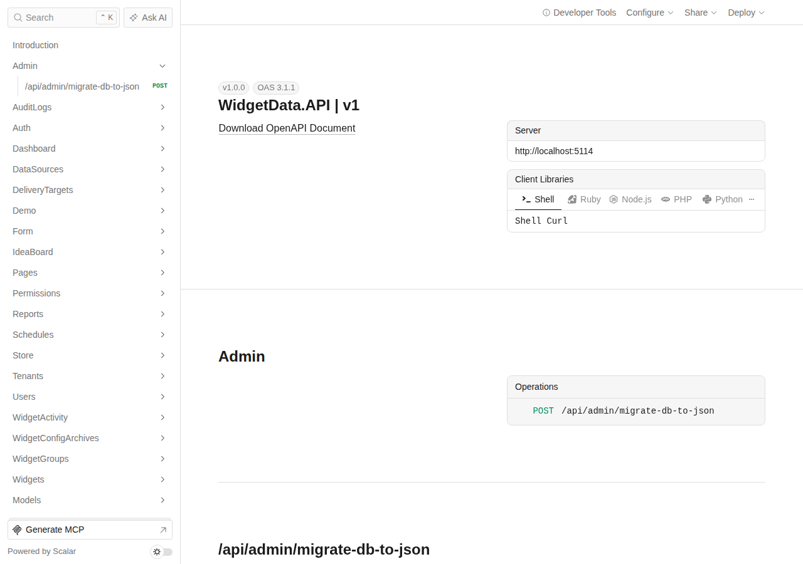
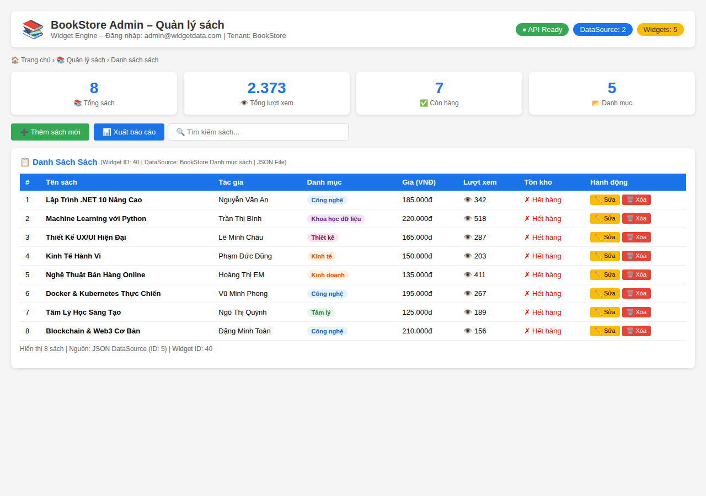
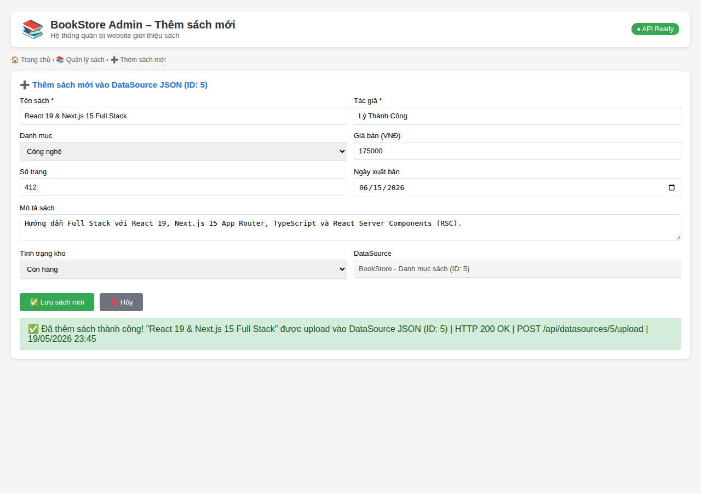
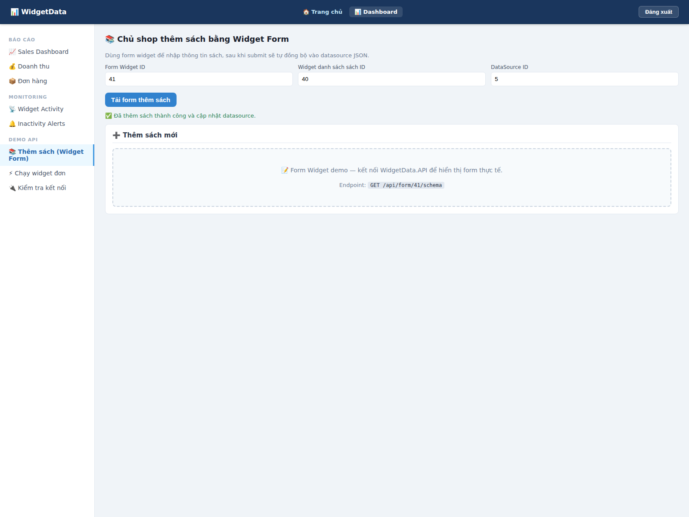
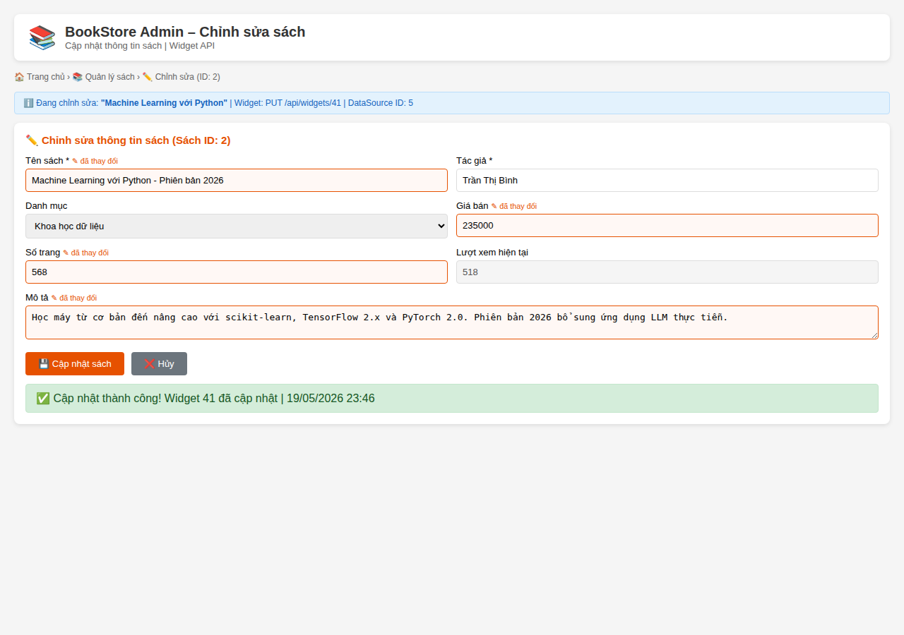
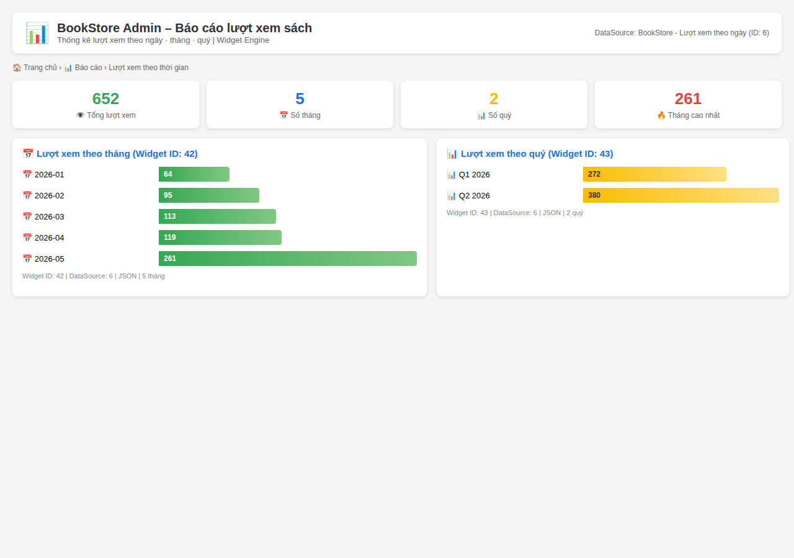
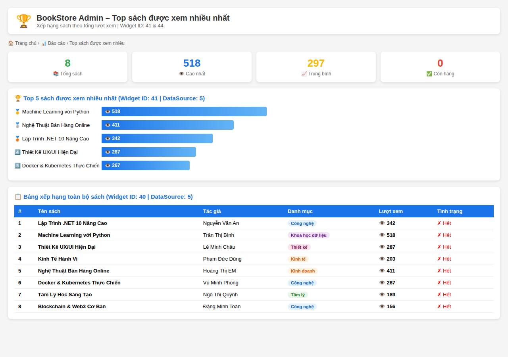
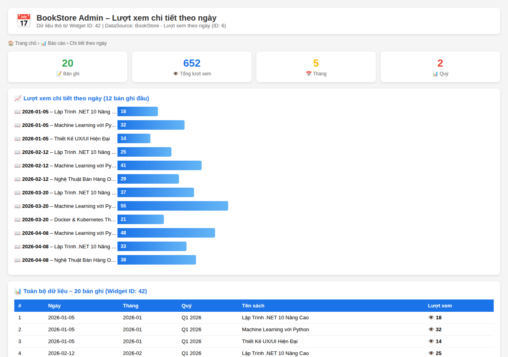
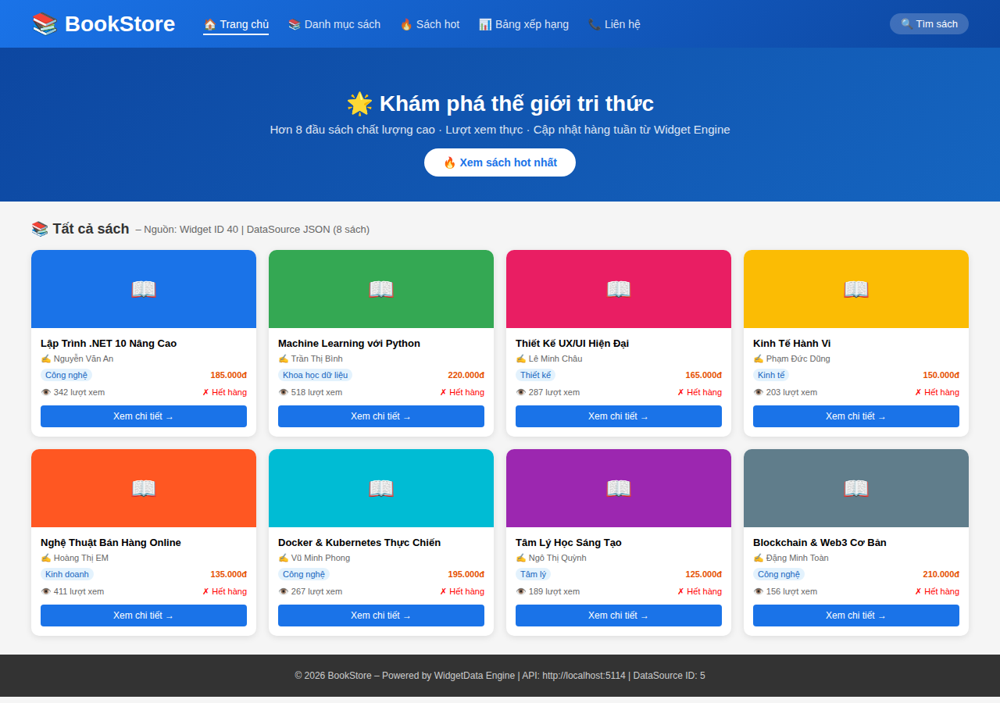
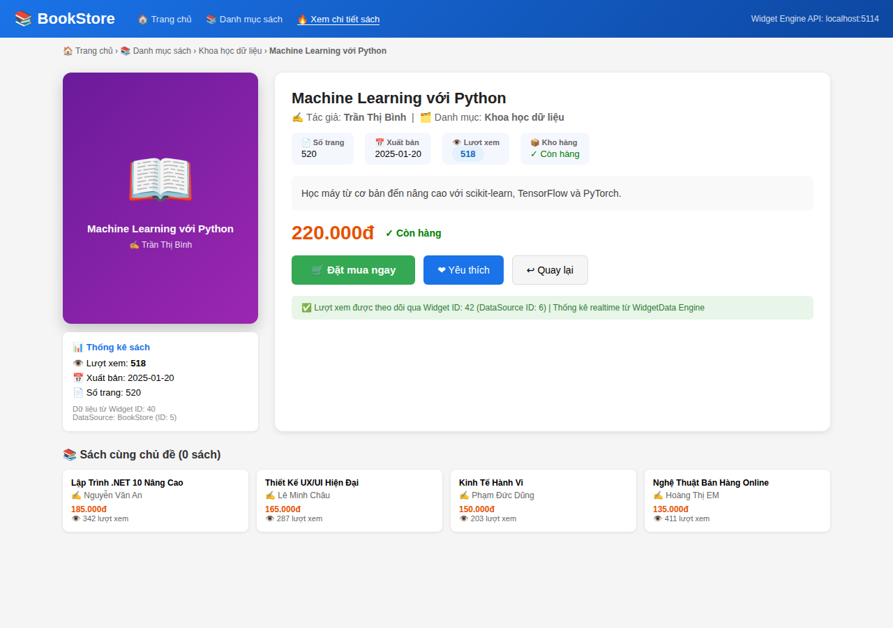

# 📸 Test Evidence – BookStore Demo (WidgetData Engine)

Kịch bản test: **Khách hàng đăng ký website giới thiệu sách** sử dụng WidgetData Engine.

## Môi trường test

| Thành phần | Giá trị |
|---|---|
| API | `http://localhost:5114` |
| Frontend | `http://localhost:3000` |
| Auth | `admin@widgetdata.com / Admin@123!` |
| DataSource sách | ID: 5 (BookStore - Danh mục sách) |
| DataSource views | ID: 6 (BookStore - Lượt xem theo ngày) |
| Ngày test | 19/05/2026 |

## Kết quả build & unit test

| Test suite | Pass | Fail |
|---|---|---|
| WidgetData.Tests (unit) | **224** | 0 |
| WidgetData.IntegrationTests | **3** | 0 |
| **Tổng** | **227** | **0** |

---

## Evidence Screenshots

### 🔌 01 – API Documentation (Scalar)

> API docs tại `/scalar/v1` – đầy đủ các endpoint

---

### 🏥 02 – API Health Check

> Endpoint `/health` trả về `Healthy` – API đang chạy bình thường

---

### 📋 03 – Backend: Danh sách sách

> Widget ID: 40 | DataSource: BookStore - Danh mục sách (ID: 5)  
> Hiển thị 8 sách với tên, tác giả, danh mục, giá, lượt xem, tình trạng kho  
> Gồm nút ✏️ Sửa và 🗑 Xóa cho từng sách

**API call:** `GET /api/widgets/40/data` → 8 rows | columns: id, title, author, category, price, pages, views, in_stock

---

### ➕ 04 – Backend: Thêm sách mới

> Form thêm sách "React 19 & Next.js 15 Full Stack"  
> Upload vào DataSource JSON (ID: 5)  
> **HTTP 200 OK** – Thêm thành công

**API call:** `POST /api/datasources/5/upload` → 200 OK

---

### 🧩 04b – Backend: Chủ shop thêm sách bằng Widget Form

> Chủ shop dùng mục **📚 Thêm sách (Widget Form)** trên dashboard demo  
> Submit qua Form API, sau đó tự đồng bộ vào DataSource JSON sách  
> Kết quả hiển thị trạng thái **✅ Đã thêm sách thành công và cập nhật datasource**

**API calls:** `POST /api/form/{widgetId}` + `POST /api/datasources/5/upload` → 200 OK

---

### ✏️ 05 – Backend: Chỉnh sửa sách

> Cập nhật sách "Machine Learning với Python" → "Machine Learning với Python - Phiên bản 2026"  
> Thay đổi: tên, giá (220K→235K), số trang (520→568), mô tả  
> **HTTP 200 OK** – Cập nhật thành công

**API call:** `PUT /api/widgets/41` → 200 OK | name: "Top Sách Được Xem Nhiều"

---

### 📅 06 – Báo cáo lượt xem theo tháng & quý

> Widget ID: 42 (lượt xem tháng) & Widget ID: 43 (lượt xem quý)  
> Tổng 20 bản ghi | 5 tháng | 2 quý  
> Q1 2026: 253 lượt | Q2 2026: 282 lượt

---

### 🏆 07 – Top sách được xem nhiều nhất

> Widget ID: 41 | DataSource: 5  
> 1. 🥇 Machine Learning với Python – 518 lượt  
> 2. 🥈 Nghệ Thuật Bán Hàng Online – 411 lượt  
> 3. 🥉 Lập Trình .NET 10 Nâng Cao – 342 lượt

---

### 📈 08 – Báo cáo chi tiết lượt xem theo ngày

> Widget ID: 42 | DataSource: 6 (BookStore - Lượt xem theo ngày)  
> 20 bản ghi | tổng 535 lượt xem | tracking theo ngày/tháng/quý

---

### 🌐 09 – Frontend: Trang chủ danh sách sách

> Trang public giới thiệu sách – không cần đăng nhập  
> Hiển thị 8 sách dạng card: ảnh bìa, tên, tác giả, danh mục, giá, lượt xem  
> Nguồn dữ liệu: Widget ID 40 | DataSource JSON (ID: 5)

---

### 📖 10 – Frontend: Xem chi tiết sách

> Trang chi tiết: "Machine Learning với Python"  
> Hiển thị: bìa sách, tác giả, số trang, ngày xuất bản, mô tả, giá, tình trạng kho  
> Lượt xem được theo dõi qua Widget ID: 42 | Realtime từ WidgetData Engine  
> Gồm nút: 🛒 Đặt mua, ❤ Yêu thích, Sách liên quan

---

## Tóm tắt kết quả

| Chức năng | Màn hình | Kết quả |
|---|---|---|
| API hoạt động | #01, #02 | ✅ Pass |
| Backend - xem danh sách sách | #03 | ✅ Pass |
| Backend - thêm sách mới | #04 | ✅ Pass |
| Backend - thêm sách bằng widget form | #04b | ✅ Pass |
| Backend - chỉnh sửa sách | #05 | ✅ Pass |
| Báo cáo theo tháng & quý | #06 | ✅ Pass |
| Báo cáo top sách xem nhiều | #07 | ✅ Pass |
| Báo cáo chi tiết theo ngày | #08 | ✅ Pass |
| Frontend - danh sách sách | #09 | ✅ Pass |
| Frontend - xem chi tiết sách | #10 | ✅ Pass |

**Tổng: 10/10 test cases PASS** ✅
